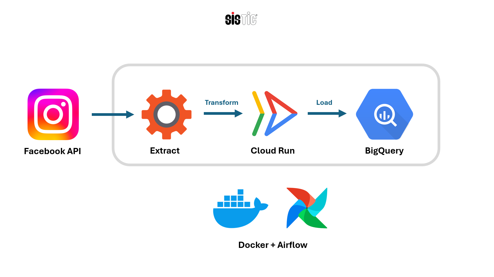

# Instagram ETL Pipeline
Data Pipeline for SISTIC Singapore, extracting data from Instagram API, transformed on Google Cloud Run, and finally loaded into Google BigQuery. 

## Motivation
This project was conceptualized to allow for easy analysis of SISTIC Singapore's Instagram posts, comments, and post insights.

It incorporates the developing of skills in the areas of API manipulation, Cloud technologies, and Orchestration tools.

## Architecture



1. Extract Instagram data from Facebook Graph API
2. Containerized Cloud Run job transforms the data
3. Processed data is loaded into BigQuery
4. Orchestrated with Airflow on Composer, email is sent on successful job run

## Output


Above is the output - three tables under the instagram_analytics dataset:
* Posts (PK: post_id)
* Insights (PK: post_id)
* Comments (PK: comment_id)

## Setup

Due to the distributed nature of compute and scheduling on the cloud, I opted to develop to contanerize solely my Cloud Run job rather than containerizing an entire Airflow instance and volume mounting my scripts. However, the option to do is available with [the official Airflow docker-compose.yaml](https://airflow.apache.org/docs/apache-airflow/stable/howto/docker-compose/index.html) file.

To test my job locally, I utilized my own [docker-compose.yaml](job/docker-compose.yaml) file, although this was not required on eventual cloud deployment. In it, the **environment variables** `INSTAGRAM_ACCOUNT_ID`, `INSTAGRAM_ACCESS_TOKEN` and Google Service Account Key are not shown in this directory due to their sensitive nature.

Locally, with the full directory and account key, only one command is required, after navigation to the terminal:

```bash
docker compose up
```

## Additional Setup and Workflow

Detailed setup and workflow instructions are available in the docs folder:
- [Instagram API Setup](docs/instagram-api-setup.md)
- [Cloud Composer Setup](docs/cloud-composer-setup.md)
- [Environment Variables](docs/environment-variables.md)
- [Authentication & Permissions](docs/authentication.md)
- [Airflow Email Task Configuration](docs/airflow-email-task-config.md)
- [Local & Cloud Development](docs/local-development.md)